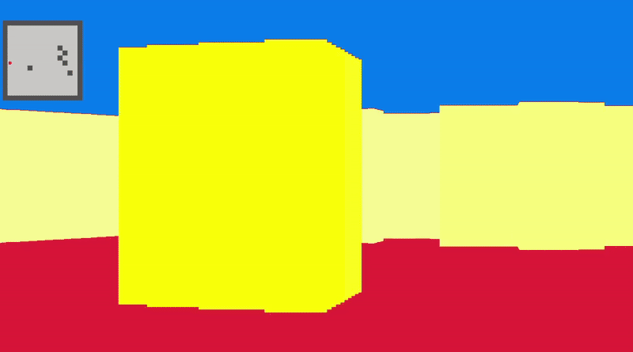

# FP-Movement

FP-Movement is a simple first-person movement and rendering demo built in C++ using the [raylib](https://www.raylib.com/) library. The project demonstrates basic concepts of first-person navigation, raycasting, and simple world rendering, including a minimap view.

## Features

- **First-Person Perspective**: Use the keyboard to move and rotate the player within a 2D map rendered as a pseudo-3D first-person view.
- **Raycasting Engine**: Simulates 3D perspective by casting rays from the player's viewpoint to detect walls and render them with shading based on distance.
- **Minimap Overlay**: Displays a 2D minimap of the environment with the player's position.
- **Procedural Map Generation**: The map layout is generated with random columns and boundaries for variety in each run.
- **Color Shading**: Wall and floor colors are shaded dynamically based on distance to enhance depth perception.

## Controls

- **W/A/S/D**: Move forward/left/backward/right.
- **Mouse**: Not used; all controls are via keyboard.
- **Left Shift**: Hold to increase movement speed ("run").
- **ESC**: Exit the application.

## Requirements

- C++17 or later
- [raylib](https://github.com/raysan5/raylib) (automatically fetched and built if not found)
- CMake 3.10 or higher

## Building and Running

1. Clone the repository:
   ```sh
   git clone https://github.com/Am1n1602/FP-Movement.git
   cd FP-Movement
   ```

2. Create a build directory and compile:
   ```sh
   mkdir build
   cd build
   cmake ..
   cmake --build .
   ```

3. Run the executable:
   ```sh
   ./FPMovement
   ```
## Demo



## File Structure

- `source.cpp` - Main application source code containing window setup, player movement, raycasting logic, and rendering.
- `CMakeLists.txt` - Project build configuration, including raylib dependency management.

---
